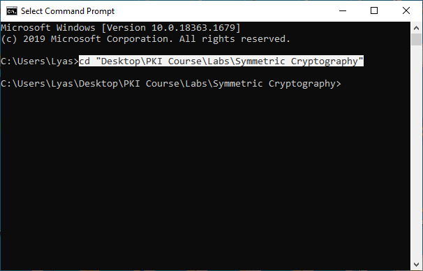
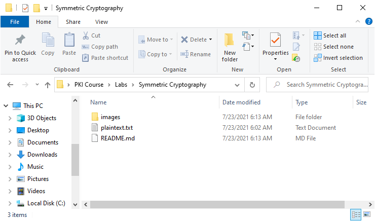

# Symmetric Cryptography Lab

1. Launch a command prompt and change directory to the "Labs\Symmetric Cryptography" directory.



2. Navigate to "Labs\Symmetric Cryptography" in an explorer window so that you can see the files in the directory.



2. You should see a file named plaintext.txt. Open it and customize the text.

3. Run the following command in the command prompt to encrypt the file. You will be prompted to enter a password.
```
openssl enc -e -aes-256-cbc -in plaintext.txt -out encrypted.txt
```

4. Examine the contents of the output file encrypted.txt. The contents of the original file have been encrypted using "symmetric encryption" in the form of a password.

5. Run the following command in the command prompt to decrypt the file you just encrypted. You will need to enter the same password you used previously.
```
openssl enc -d -aes-256-cbc -in encrypted.txt -out decrypted.txt
```
6. Examine the contents of the output file decrypted.txt. You should see the same text as the original plaintext.txt file. Notice the arguments used for the commands, "-in", "-out", etc. These arguments are used to indicate the names of input and output files and customize the execution of the command. Input files must already exist and output files will be created if they don't already exist. See https://www.openssl.org/docs/man1.1.1/man1/openssl-enc.html for documentation on the "openssl enc" command to explore all of the options.